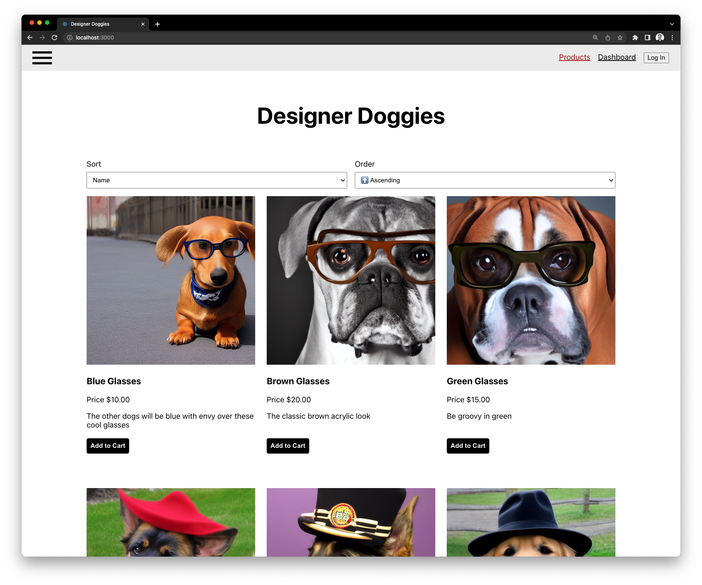

# Designer Doggies

A demonstration of a monorepo full stack web application built on the PERN (postgres, express, react and node) stack.

---

## Getting Started

**To run the app:**
Open the project in VS Code and open via the workspace file
Open the command prompt and select "File: Open Workspace from File..."

This may ask you to install plugins for VS Code, follow the prompts and install the suggestions.

Once that has loaded run the docker up command via right clicking on the `docker-compose.yml` file in the "ROOT" folder and select "Compose Up"

You can debug the client by running the task "Chrome (Client)" this will allow you to place breakpoints in your client code.

You can debug the server by running the task "Docker: Attach to Node (Server)" this also will allow you to place breakpoints in your server code.

---
